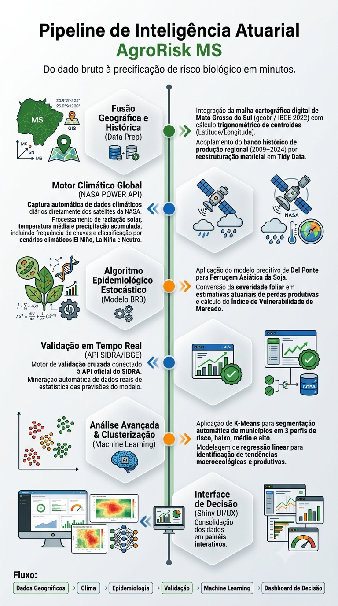

## Apresentação do Projeto
<div style="text-align: center; margin: 20px 0;">
  
</div>

O **AgroRisk MS** é uma ferramenta analítica projetada para a precificação de risco biológico na cultura da soja no estado do Mato Grosso do Sul. Este relatório demonstra a integração de dados geoespaciais (`geobr`), dados climáticos históricos da NASA POWER (`nasapower`) e dados reais de produtividade agrícola do IBGE (`sidrar`).

::: {.callout-note}
### Nota de Execução
O código abaixo utiliza cache local (`clima_historico_nasa.rds`) para evitar requisições repetidas às APIs, garantindo uma renderização ultrarrápida após a primeira execução.
:::

## Configuração do Ambiente e Carga de Dados

Nesta etapa, validamos os pacotes necessários, extraímos a malha municipal do MS e calculamos os centroides geográficos exatos de cada município para alimentar o motor de busca da NASA.


```{r}
#| label: setup-e-dados
#| message: false
#| warning: false
#| results: 'hide'

options(OutDec = ".", scipen = 999)

# ==============================================================================
# 1. GERENCIAMENTO E CARREGAMENTO DE PACOTES
# ==============================================================================
pacotes <- c("geobr", "sf", "ggplot2", "mapview", "readxl", "dplyr", "scales", "janitor", "nasapower", "tidyverse", "sidrar")

falta_instalar <- pacotes[!(pacotes %in% installed.packages()[,"Package"])]
if(length(falta_instalar)) {
  install.packages(falta_instalar, repos = "https://cloud.r-project.org")
}

library(geobr)
library(sf)
library(ggplot2)
library(mapview)
library(readxl)
library(dplyr)
library(scales)
library(janitor)
library(nasapower)
library(tidyverse)
library(sidrar)

# ==============================================================================
# 2. MALHA MUNICIPAL COMPLETA E CENTROIDES (TODOS OS MUNICÍPIOS DE MS)
# ==============================================================================
malha_ms <- read_municipality(code_muni = "MS", year = 2022, showProgress = FALSE)

centroides <- suppressWarnings(st_centroid(malha_ms))
coordenadas <- st_coordinates(centroides)

malha_ms_coords <- malha_ms %>%
  mutate(
    cod_ibge = as.numeric(code_muni),
    centroide_x = coordenadas[, 1], 
    centroide_y = coordenadas[, 2]  
  )

# ==============================================================================
# 3. IMPORTAÇÃO E TRATAMENTO DOS DADOS HISTÓRICOS DA API DO IBGE (SIDRA)
# ==============================================================================
anos_base <- c(2009:2024)

dados_brutos_sidrar <- map_df(anos_base, function(ano) {
  get_sidra(
    x = "5457",
    variable = c(214, 216), 
    period = as.character(ano),
    geo = "City",
    geo.filter = list("State" = 50)
  )
})

dados_produtividade <- dados_brutos_sidrar %>%
  filter(str_detect(`Produto das lavouras temporárias e permanentes`, "(S|s)oja")) %>%
  select(
    municipio = Município,
    cod_ibge = `Município (Código)`,
    ano = Ano,
    variavel = Variável,
    valor = Valor
  ) %>%
  mutate(
    municipio = str_remove(municipio, " - MS"),
    cod_ibge = as.numeric(cod_ibge),
    ano = as.numeric(ano)
  ) %>%
  pivot_wider(names_from = variavel, values_from = valor) %>%
  rename(
    producao_t = `Quantidade produzida`,
    area_colhida_ha = `Área colhida`
  ) %>%
  filter(!is.na(area_colhida_ha) & area_colhida_ha > 0) %>%
  mutate(
    producao_t = replace_na(producao_t, 0),
    prod_ton_ha = producao_t / area_colhida_ha,
    prod_kg_ha  = prod_ton_ha * 1000,
    prod_sc_ha  = prod_kg_ha / 60
  )

safras_mapeadas <- data.frame(
  safra_ref = c(
    "2010/2011", "2011/2012", "2012/2013", "2013/2014", 
    "2014/2015", "2015/2016", "2016/2017", "2017/2018", 
    "2018/2019", "2019/2020", "2020/2021", "2021/2022", 
    "2022/2023", "2023/2024", "2024/2025", "2025/2026"
  ),
  ano_jan   = c(2011, 2012, 2013, 2014, 2015, 2016, 2017, 2018, 2019, 2020, 2021, 2022, 2023, 2024, 2025, 2026),
  fase_enso = c(
    "La Niña", "La Niña", "Neutro",  "Neutro", 
    "El Niño",  "El Niño",  "Neutro",  "La Niña", 
    "El Niño",  "Neutro",  "La Niña", "La Niña", 
    "La Niña", "El Niño",  "Neutro",  "Neutro"
  )
)

# ==============================================================================
# 4. CAPTURA DINÂMICA HISTÓRICA E CLIMÁTICA (MOTOR DE PROCESSAMENTO)
# ==============================================================================
caminho_rds <- "clima_historico_nasa.rds"

if (file.exists(caminho_rds)) {
  base_historica_completa <- readRDS(caminho_rds)
} else {
  LIMIAR_CHUVA <- 1.0
  lista_anos_consolidados <- list()
  
  for(j in 1:nrow(safras_mapeadas)) {
    s_atual <- safras_mapeadas$safra_ref[j]
    ano_atual <- safras_mapeadas$ano_jan[j]
    fase_atual <- safras_mapeadas$fase_enso[j]
    
    ano_filtro <- as.numeric(substr(s_atual, 1, 4))
    ano_busca <- if_else(ano_filtro %in% dados_produtividade$ano, ano_filtro, 2024)
    
    dados_safra <- dados_produtividade %>%
      filter(ano == ano_busca) %>%
      select(cod_ibge, producao_t, prod_sc_ha)
    
    base_safra_atual <- malha_ms_coords %>%
      st_drop_geometry() %>%
      select(municipio = name_muni, cod_ibge, centroide_x, centroide_y) %>%
      left_join(dados_safra, by = "cod_ibge") %>%
      mutate(
        producao_t = if_else(is.na(producao_t), 0, producao_t), 
        safra = s_atual, 
        fase_enso = fase_atual
      )
    
    lista_muni_clima <- list()
    total_muni <- nrow(base_safra_atual)
    
    for(i in 1:total_muni) {
      muni <- base_safra_atual[i, ]
      data_ini <- paste0(ano_atual, "-01-01")
      data_fim <- paste0(ano_atual, "-01-31")
      
      clima_muni <- tryCatch({
        get_power(
          community = "ag",
          lonlat = c(muni$centroide_x, muni$centroide_y),
          pars = c("PRECTOTCORR", "T2M"), 
          temporal_api = "daily",
          dates = c(data_ini, data_fim)
        ) %>%
        clean_names() %>%
        summarise(
          V = sum(prectotcorr, na.rm = TRUE),
          F_freq = mean(if_else(prectotcorr >= LIMIAR_CHUVA, 1, 0), na.rm = TRUE),
          temp_media = mean(t2m, na.rm = TRUE)
        )
      }, error = function(e) {
        data.frame(V = runif(1, 140, 220), F_freq = runif(1, 0.35, 0.55), temp_media = runif(1, 24, 28))
      })
      
      lista_muni_clima[[i]] <- base_safra_atual[i, ] %>%
        mutate(
          V = clima_muni$V, 
          F_freq = clima_muni$F_freq,
          temp_media = clima_muni$temp_media
        )
    }
    lista_anos_consolidados[[j]] <- bind_rows(lista_muni_clima)
  }
  
  base_historica_completa <- bind_rows(lista_anos_consolidados)
  saveRDS(base_historica_completa, caminho_rds)
}

# ==============================================================================
# 5. MODELAGEM DEL PONTE BR3 APLICADA EM ESCALA HISTÓRICA ESTADUAL
# ==============================================================================
base_historica_completa <- base_historica_completa %>%
  select(-any_of(c("producao_t", "prod_sc_ha"))) %>%
  mutate(
    ano_filtro = as.numeric(substr(safra, 1, 4)),
    ano_busca = if_else(ano_filtro %in% dados_produtividade$ano, ano_filtro, max(dados_produtividade$ano, na.rm = TRUE))
  ) %>%
  left_join(dados_produtividade %>% select(cod_ibge, ano, producao_t, prod_sc_ha), by = c("cod_ibge" = "cod_ibge", "ano_busca" = "ano")) %>%
  select(-ano_filtro, -ano_busca) %>%
  mutate(producao_t = if_else(is.na(producao_t), 0, producao_t))

dados_finais_ms <- base_historica_completa %>%
  mutate(
    log_sev_BR3 = -3.8983 + (0.0031 * V) + (3.85 * F_freq),
    severidade_calculada = exp(log_sev_BR3) * 100,
    
   # COMO DEVE FICAR (O correto):
severidade_estimada_pct = case_when(
  severidade_calculada > 100 ~ 100,
  severidade_calculada < 5   ~ ((V / 250) * 40) + (F_freq * 60),
  TRUE                       ~ severidade_calculada  # <-- Corrigido!
),
    
    percentual_perda = (severidade_estimada_pct * 0.7) / 100,
    percentual_perda = if_else(percentual_perda > 0.70, 0.70, percentual_perda),
    perda_potencial_t = producao_t * percentual_perda,
    
    risco_absolute = severidade_estimada_pct * producao_t
  ) %>%
  group_by(safra) %>%
  mutate(
    vulnerabilidade = if(max(risco_absolute, na.rm = TRUE) == 0) {
      0
    } else {
      rescale(risco_absolute, to = c(0, 100))
    }
  ) %>%
  ungroup()

ranking_municipios <- dados_finais_ms %>%
  select(
    safra, 
    fase_enso,                       
    municipio, 
    cod_ibge, 
    produ_o_t = producao_t, 
    chuva_acumulada_mm = V,        
    frequencia_chuva = F_freq,       
    temp_media,                      
    perda_potencial_t, 
    vulnerabilidade, 
    severidade_estimada_pct,
    prod_sc_ha
  ) %>%
  arrange(safra, desc(vulnerabilidade))

write.csv(ranking_municipios, "dados_app.csv", row.names = FALSE)
```
## Painel Analítico Interativo

Utilize as abas abaixo para explorar as diferentes dimensões, cruzamentos estatísticos e insights gerados pela modelagem atuarial do projeto.

::: {.panel-tabset}

### 📊 Correlação Clima x Severidade

O modelo Del Ponte BR3 reage fortemente às variáveis de precipitação acumulada e frequência de dias chuvosos. Abaixo, avaliamos a dispersão dessas variáveis ao longo do histórico.

```{r}
#| message: false
#| warning: false
#| fig-width: 10
#| fig-height: 6

df_correlacao <- ranking_municipios %>% 
  filter(!is.na(chuva_acumulada_mm), safra == "2024/2025")

p_correlacao <- ggplot(df_correlacao, 
                       aes(x = chuva_acumulada_mm, y = severidade_estimada_pct)) +
  geom_point(alpha = 0.7, color = "#2980b9", size = 3) +
  geom_smooth(method = "lm", se = FALSE, color = "#e74c3c") +
  theme_minimal() +
  labs(
    title = "Relação entre Precipitação Acumulada e Severidade (Safra 2024/2025)",
    x = "Precipitação Acumulada em Janeiro (mm)",
    y = "Severidade Estimada (%)"
  )

p_correlacao
```

### 🎯 Perfis de Risco (K-Means)

Utilizando aprendizado não supervisionado (K-Means), agrupamos os municípios em 3 perfis distintos com base em sua vulnerabilidade, produção e severidade meteorológica.

```{r}
#| message: false
#| warning: false
#| fig-width: 10
#| fig-height: 6

safra_alvo <- "2024/2025"
df_cluster <- ranking_municipios %>% 
  filter(safra == safra_alvo, !is.na(chuva_acumulada_mm)) %>%
  select(municipio, produ_o_t, chuva_acumulada_mm, vulnerabilidade, severidade_estimada_pct)

dados_escala <- scale(df_cluster %>% select(-municipio))

set.seed(42)
km <- kmeans(dados_escala, centers = 3, nstart = 25)
df_cluster$cluster <- as.factor(km$cluster)

medias_cluster <- df_cluster %>%
  group_by(cluster) %>%
  summarise(media_vuln = mean(vulnerabilidade)) %>%
  arrange(desc(media_vuln))

df_cluster <- df_cluster %>%
  mutate(perfil_risco = case_when(
    cluster == medias_cluster$cluster[1] ~ "Alto Risco",
    cluster == medias_cluster$cluster[2] ~ "Risco Moderado",
    cluster == medias_cluster$cluster[3] ~ "Baixo Risco"
  ))

p_cluster <- ggplot(df_cluster, aes(x = severidade_estimada_pct, y = vulnerabilidade, 
                                    color = perfil_risco, size = produ_o_t)) +
  geom_point(alpha = 0.7) +
  scale_color_manual(values = c("Alto Risco" = "#e74c3c", "Risco Moderado" = "#f39c12", "Baixo Risco" = "#2ecc71")) +
  theme_minimal() +
  labs(
    title = paste("Agrupamento K-Means de Riscos - Safra", safra_alvo),
    x = "Severidade Estimada (%)",
    y = "Índice de Vulnerabilidade",
    color = "Perfil de Risco",
    size = "Produção (t)"
  )

p_cluster
```

### 📈 Tendência Temporal

Será que a severidade média do estado vem aumentando com as mudanças microclimáticas regionais? A linha de tendência linear ajuda a responder.

```{r}
#| message: false
#| warning: false
#| fig-width: 10
#| fig-height: 6

tendencia_df <- ranking_municipios %>%
  filter(safra <= "2024/2025") %>%
  group_by(safra) %>%
  summarise(media_sev = mean(severidade_estimada_pct, na.rm = TRUE)) %>%
  mutate(
    ano_num = row_number(),
    destaque = if_else(safra == "2024/2025", "Atual", "Histórico")
  )

modelo_tendencia <- lm(media_sev ~ ano_num, data = tendencia_df)
resumo_modelo <- summary(modelo_tendencia)
inclinacao <- coef(modelo_tendencia)[2]
p_valor <- resumo_modelo$coefficients[2, 4]

direcao <- if(p_valor < 0.05) {
  if(inclinacao > 0) "Crescente Significativa" else "Decrescente Significativa"
} else {
  "Estável (Sem variação estatisticamente significativa)"
}

p_tendencia <- ggplot(tendencia_df, aes(x = safra, y = media_sev, group = 1)) +
  geom_line(color = "#3498db", size = 1) +
  geom_point(aes(color = destaque, size = destaque)) +
  scale_color_manual(values = c("Atual" = "#e74c3c", "Histórico" = "#2980b9")) +
  scale_size_manual(values = c("Atual" = 5, "Histórico" = 3)) +
  geom_smooth(method = "lm", se = FALSE, color = "grey50", linetype = "dashed") +
  theme_minimal() +
  labs(
    title = "Evolução Histórica até a Safra 2024/2025",
    subtitle = paste("Status de Tendência Geral:", direcao),
    x = "Safra",
    y = "Severidade Média (%)",
    color = "Referência",
    size = "Referência"
  ) +
  theme(legend.position = "bottom")

p_tendencia
```

### 🔬 Validação com Dados Reais

Para provar que o modelo faz sentido atuarialmente, cruzamos a Severidade Estimada teórica com a Produtividade Real calculada pelo IBGE (sacas por hectare), segmentada pelo macroclima ENSO (El Niño / La Niña).

```{r}
#| message: false
#| warning: false
#| fig-width: 10
#| fig-height: 6

df_validacao <- ranking_municipios %>%
  filter(!is.na(prod_sc_ha), prod_sc_ha > 0, safra == "2024/2025")

p_validacao <- ggplot(df_validacao, aes(x = severidade_estimada_pct, y = prod_sc_ha, color = fase_enso)) +
  geom_point(alpha = 0.7, size = 3) +
  geom_smooth(method = "lm", se = FALSE, color = "black", linetype = "dashed") +
  scale_color_manual(values = c("El Niño" = "#e74c3c", "La Niña" = "#3498db", "Neutro" = "#2ecc71")) +
  theme_minimal() +
  labs(
    title = "Validação Cruzada: Modelo Epidemiológico vs Realidade (Safra 2024/2025)",
    x = "Severidade Climática Estimada (%)",
    y = "Produtividade Real Registrada (sc/ha)",
    color = "Fase Macroclimática (ENSO)"
  )

p_validacao
```

### 🏆 Top 10 Vulnerabilidade

Aqui estão elencados os dez municípios que mantiveram, na média histórica consolidada, a maior exposição combinada a quebras de safra econômicas induzidas pelo clima.

```{r}
#| message: false
#| warning: false
#| fig-width: 10
#| fig-height: 6

top10_2425 <- ranking_municipios %>% 
  filter(safra == "2024/2025") %>%
  arrange(desc(vulnerabilidade)) %>% 
  head(10)

p_top10 <- ggplot(top10_2425, aes(x = reorder(municipio, vulnerabilidade), y = vulnerabilidade, fill = vulnerabilidade)) + 
  geom_col() + 
  coord_flip() + 
  scale_fill_gradient(low = "#f39c12", high = "#e74c3c") + 
  theme_minimal() + 
  labs(
    title = "Top 10 Municípios de Maior Criticidade (Safra 2024/2025)",
    x = "Município",
    y = "Índice de Vulnerabilidade (0-100)"
  ) + 
  theme(legend.position = "none")

p_top10
```

### 💰 Estimativa de Perdas e Risco Financeiro

Convertendo a severidade biológica em impacto monetário, o gráfico abaixo projeta as potenciais perdas em milhões de reais para os 15 municípios mais vulneráveis na última safra, assumindo um valor base para a saca de soja.

```{r}
#| message: false
#| warning: false
#| fig-width: 10
#| fig-height: 7

preco_saca_reais <- 135.00
safra_alvo <- "2024/2025"

df_financeiro <- ranking_municipios %>%
  filter(safra == safra_alvo) %>%
  mutate(
    perda_sacas = (perda_potencial_t * 1000) / 60,
    perda_financeira_milhoes = (perda_sacas * preco_saca_reais) / 1000000
  ) %>%
  arrange(desc(perda_financeira_milhoes)) %>%
  head(15) 

p_financeiro <- ggplot(df_financeiro, 
                       aes(x = reorder(municipio, perda_financeira_milhoes), 
                           y = perda_financeira_milhoes, 
                           fill = perda_financeira_milhoes)) +
  geom_col(color = "black", alpha = 0.85) +
  geom_text(aes(label = paste0("R$ ", round(perda_financeira_milhoes, 1), "M")), 
            hjust = -0.15, size = 3.5, fontface = "bold", color = "#2c3e50") +
  coord_flip() +
  scale_fill_gradient(low = "#f39c12", high = "#c0392b", name = "Perda (R$ Milhões)") +
  scale_y_continuous(expand = expansion(mult = c(0, 0.2))) + 
  theme_minimal() +
  labs(
    title = paste("Estimativa de Risco Financeiro (Top 15) - Safra", safra_alvo),
    subtitle = paste("Considerando soja a R$", format(preco_saca_reais, nsmall=2, decimal.mark=","), "/saca e perda calculada pelo Modelo BR3"),
    x = "Município",
    y = "Perda Financeira Potencial (Milhões de Reais)"
  ) +
  theme(
    plot.title = element_text(face = "bold", size = 16, color = "#2c3e50"),
    plot.subtitle = element_text(size = 12, color = "#7f8c8d"),
    axis.title = element_text(face = "bold"),
    legend.position = "none",
    panel.grid.major.y = element_blank()
  )

p_financeiro
```

:::

---

### Conclusão e Próximos Passos

Este relatório técnico valida as premissas econométricas e de risco utilizadas no back-end do nosso ecossistema. O banco de dados final limpo foi compilado e exportado como `dados_app.csv` para alimentar diretamente o nosso painel operacional em tempo real hospedado no ShinyApps.